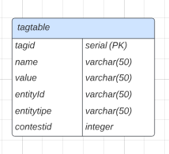
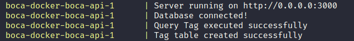

# API BOCA - NODE.JS

## Introdução

Esta API foi feita com o objetivo de propor uma forma de realizar pesquisas a partir de Tags no banco de dados do sistema de correção automático BOCA. O trabalho foi proposto pelo professor [Rodrigo Laiola](https://github.com/rlaiola) na disciplina de Banco de Dados I do Curso Engenharia de Computação na UFES, e realizado pelos alunos [Emerson Laranja](https://github.com/EmersonLaranja) e [Hiuri C. Liberato](https://github.com/hiuri).

## Considerações

Como a API foi um trabalho acadêmico realizado durante o semestre na disciplina de Banco de Dados I, o principal objetivo deste é que os alunos pratiquem a utilização de comandos SQL e modelagem de dados. Portanto, validações e autenticação foram abstraídos.

## Desenvolvimento

O código foi desenvolvido pelos alunos [Emerson Laranja](https://github.com/EmersonLaranja) e [Hiuri C. Liberato](https://github.com/hiuri). Para isso foi utilizado o Visual Studio Code com a extensão Live Share, que permite que dois desenvolvedores trabalhem em um mesmo código ao mesmo tempo. E o versionamento foi realizado através do uso do Git.
O estudo e a modelagem ER, para propor a solução do problema foram realizados na plataforma Lucidchart.

### Etapas da execução do trabalho

- [x] Modelar a solução do problema proposto
- [x] Construir a imagem corretamente/subir para o docker hub
- [x] Projetar a entidade tag, campos, relacionamento
- [x] Criar a ROTA Recuperar tags de entidade
- [x] Criar a ROTA Criar tags de entidades
- [x] Criar a ROTA Atualizar tags de entidades
- [x] Criar a ROTA Excluir tags de entidades
- [x] Realizar testes

## Tecnologias

- [Node.js](https://nodejs.org/en/) É um Software multiplataforma baseado em [JavaScript](https://www.javascript.com/) que consegue o interpretar fora do Browser
- [Express.js](https://expressjs.com/) É um framework para [Node.js](https://nodejs.org/en/) que fornece recursos para construção de servidores e aplicações web.
- [Docker](https://www.docker.com/) Docker é um provedor de “containers”, trazendo da web ou de seu repositório interno uma imagem completa, incluindo todas as dependências necessárias para executar uma aplicação.
- [PostgreSQL](https://www.postgresql.org/) Sistema de banco de dados objeto-relacional de código aberto
- [Swagger](https://swagger.io/) O Swagger é um framework composto por diversas ferramentas que, independente da linguagem, auxilia a descrição, consumo e visualização de serviços de uma API REST.

## Bibliotecas

- [PG](https://www.npmjs.com/package/pg) Cliente PostgreSQL para Node.js. Através dele conectamos a API no banco
- [Express](https://expressjs.com/) Framework para Node.js que facilita a criação de rotas e requisições HTTP.
- [dotenv](https://www.npmjs.com/package/dotenv) foi usado para as variáveis de ambiente

## Decisões de projeto

Optamos por criar apenas a tabela Tags, pois não consideramos necessário utilizar uma tabela para guardar as entidades.
Num primeiro momento haviamos modelado com duas tabelas, uma para Entities e outra para Tags, porém com o desenvolvimento do trabalho notamos que poderiamos simplificar a implementação utilizando apenas uma tabela, a de tags.

Para o get criamos duas rotas, uma para atender o caso 'site/user', já que a sua estrutura para passar os parametros é diferente, e outra rota para atender os demais casos.

### Modelagem de banco de dados

Utilizamos apenas uma tabela, onde guardamos as informações das entities e tags.

### Roteamento

Para realizar o roteamento utilizamos o padrão REST, implementando a partir da biblioteca [Express](https://expressjs.com/) do JavaScript. Abaixo seguem nossas rotas:

Rota utilizada para criar novas tags:

- post: `router.post("/api/contest/:contestId/tags", tagsController.createTag)`

Rota utilizada para atualizar tags:

- put: `router.put("/api/contest/:contestId/tags", tagsController.updateTag)`

Rota utilizada para deletar tags:

- delete: `router.delete("/api/contest/:contestId/tags", tagsController.deleteTag)`

As duas rotas abaixo são para requisições do tipo get, nossa solução utiliza duas rotas graças ao caso "site/user", em que há uma estrutura diferente das outras Entities:

- get: `router.get("/api/contest/:contestId/tags/site/user/:siteId/:userId/:tagId?/:tagName?/:tagValue?",tagsController.getTags)`

- get: `router.get("/api/contest/:contestId/tags/:entityType/:entityId/:tagId?/:tagName?/:tagValue?", tagsController.getTags)`

### Variáveis de ambiente

No projeto existem algumas variáveis de ambiente que podem ser configuradas diretamente nos arquivos de docker-compose-api-dev.yml e docker-compose-api-prod.yml. Essas variáveis são:

- `PORT`: Porta que a API irá rodar.
- `DB_HOST`: Host do banco de dados.
- `DB_PORT`: Porta do banco de dados.
- `DB_USER`: Usuário do banco de dados.
- `DB_PASSWORD`: Senha do banco de dados.
- `DB_NAME`: Nome do banco de dados.
- `UP_DATABASE`: Aceita os valores de true ou false, se for true a API irá atualizar e criar novas tabelas no banco de dados assim que for iniciada, se for false a API não fará essa ação. É recomendável deixar essa opção como true apenas a primeira vez que a API for executada, depois deve ser mudada para false.

Disclaimer: O ideal seria não subir o arquivo .env para o github, mas para facilitar a execução, assim fizemos.

## Instalação e Execução

Para instalar o projeto é necessário ter o [Docker](https://www.docker.com/) e o [Docker Compose](https://docs.docker.com/compose/) instalados.

Para executar siga os seguintes passos:

1. Para permitir rodar seu script, se estiver num sistema UNIX, basta executar `chmod +x ./script.sh `
2. Execute o comando `./script.sh run`

Esse é um script criado para executar os arquivos docker-compose que são responsáveis por inicializar os containers do BOCA e da API criada por nós.

Por baixo dos panos, unimos a inicilização do container da API ao arquivo `docker-compose.yml`, então é o mesmo que executarmos:
`docker compose -f docker-compose.prod.yml -f docker-compose.yml up --build`

Após uns instantes, aparecerá a messagem abaixo indicando que o servidor está disponível:

Esse [script](https://github.com/UFES20231BDCOMP/trabalho-1-emerson-e-hiuri/blob/master/script.sh) sobe primeiro o banco de dados e os demais serviços e depois roda a API.

## Testes e documentação

Na documentação da API BOCA, foi utilizado o [Swagger](https://swagger.io/) para descrever e visualizar os serviços da API.

Ao executar a API BOCA, você pode acessar a documentação do Swagger em http://0.0.0.0:3000/docs/. Lá você encontrará uma interface interativa que lista todas as rotas disponíveis e fornece informações detalhadas sobre cada uma delas, incluindo parâmetros, corpo da requisição, possíveis respostas e exemplos.

### Video mostrando a execução
Dado que tivemos complicações com tempo e os testes, fizemos um vídeo mostrando a execução do projeto:
https://youtu.be/gl76pzSncZA
